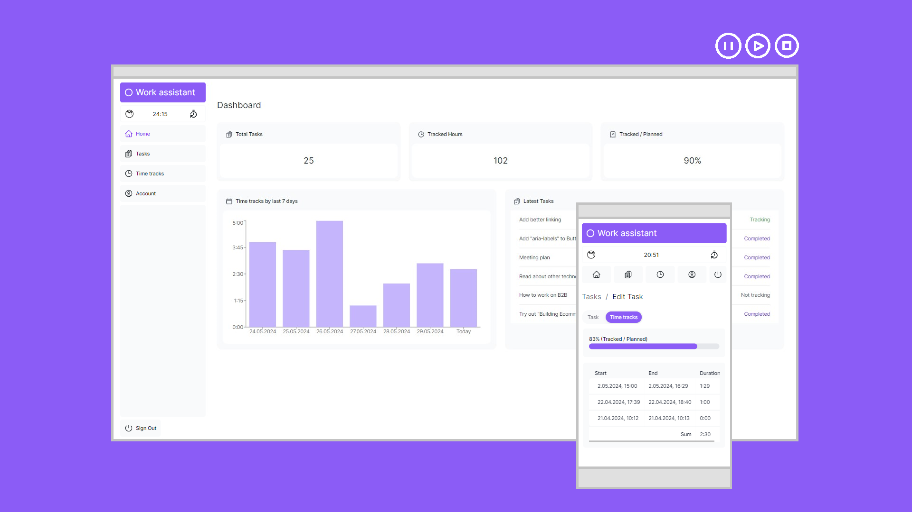
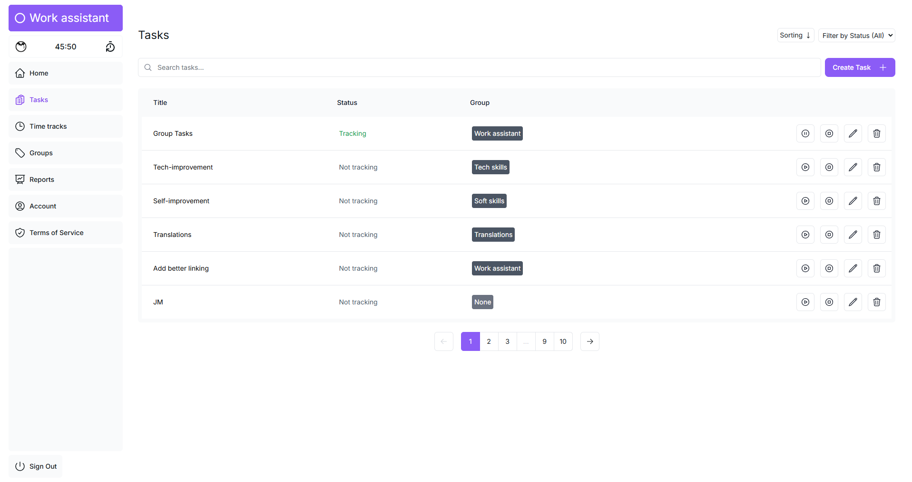

# Work assistant (in progress)

Increase efficiency and pleasure of your work.

## [Demo](https://work-assistant-puce.vercel.app/)

## How it works

Done

- Terms of Service and Privacy Policy :heavy_check_mark:
- Sign in by email (authentication link) :heavy_check_mark:
- Create/Edit tasks with planned completion time :heavy_check_mark:
- Start/stop tracking time of current task :heavy_check_mark:
- Complete task :heavy_check_mark:
- Continually check the status of tasks (Planned Completion Time vs Tracked Time) :heavy_check_mark:
- Check all your "Time tracks" and edit it if you need to :heavy_check_mark:
- Check general reports of your work on dashboard :heavy_check_mark:
  - Number of created tasks :heavy_check_mark:
  - Total tracked hours :heavy_check_mark:
  - Tracked / Planed (%) of all completed tasks :heavy_check_mark:
  - Time tracks by last 7 days :heavy_check_mark:
  - Latest created Tasks :heavy_check_mark:
- Delete your account with all associated data (Tasks, Time tracks) :heavy_check_mark:

Planned

- Create hierarchical Tasks
- Export work status/reports
- Pomodoro timer working on background, tells you when you should take a break, change position and so on
  - Configure interval
  - Configure break messages
- Ask AI

## Screenshot

