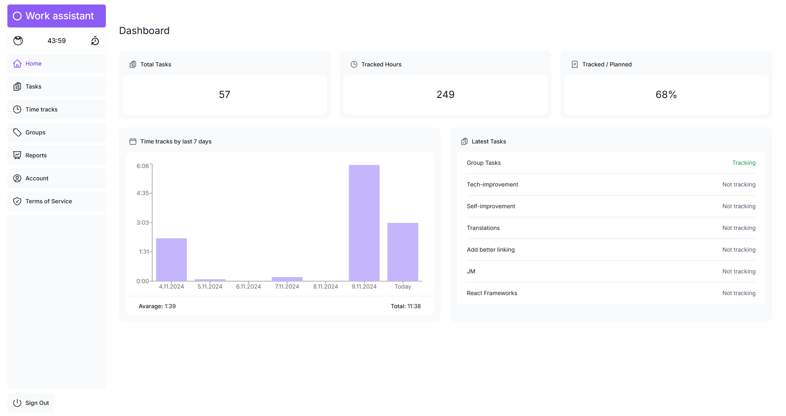
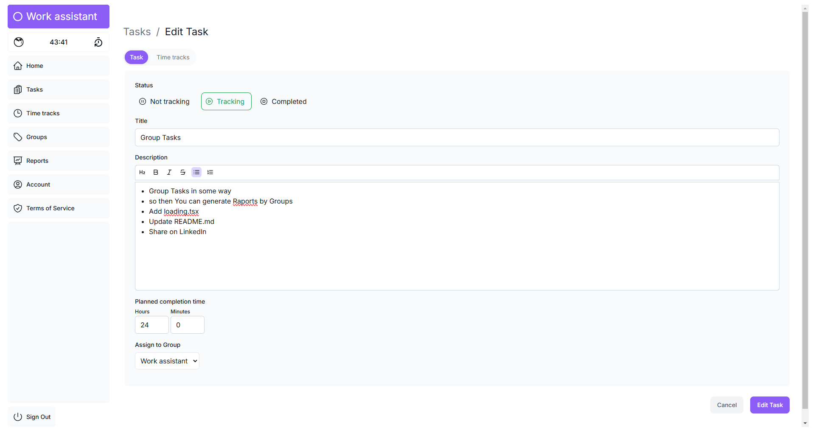
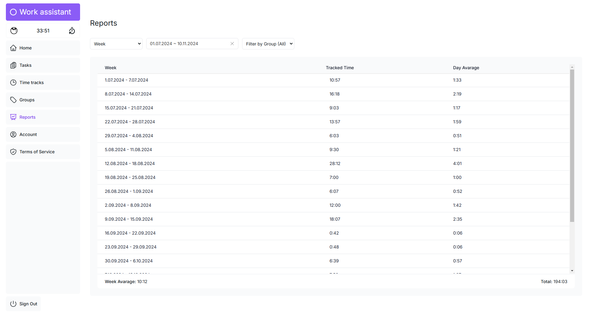
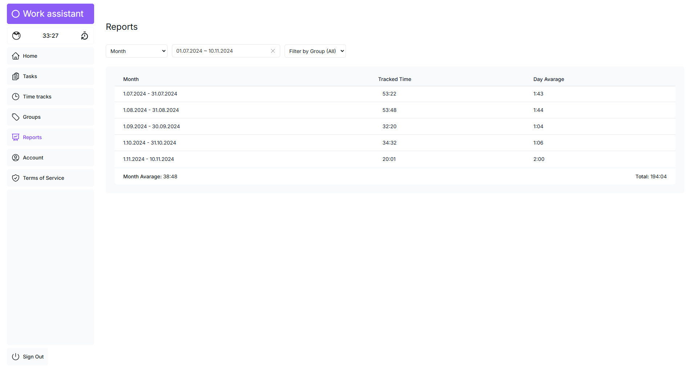

# Work Assistant

Enhance your productivity and enjoy your work more with Work Assistant.

## [Live Demo](https://work-assistant-puce.vercel.app/)

## Overview

Work Assistant is a comprehensive tool designed to help you manage tasks, track time, and generate insightful reports. It integrates seamlessly with your workflow, providing features like task management, time tracking, and reporting, all in one place.

## Technologies Used

This project leverages a modern tech stack to deliver a robust and scalable application:

- **[Next.js](https://nextjs.org/):** A React framework for building fast and scalable web applications.
- **[React](https://reactjs.org/):** A JavaScript library for creating user interfaces.
- **[Auth.js](https://authjs.dev/):** Provides authentication capabilities for Next.js applications.
- **[TypeScript](https://www.typescriptlang.org/):** A typed superset of JavaScript that enhances code quality and maintainability.
- **[Tailwind CSS](https://tailwindcss.com/):** A utility-first CSS framework for rapid UI development.
- **[Prisma](https://www.prisma.io/):** A next-generation ORM for Node.js and TypeScript.
- **[PostgreSQL](https://www.postgresql.org/):** A powerful, open-source relational database system.
- **[Vercel](https://vercel.com/):** A platform for deploying and hosting Next.js applications.

## Features

### Completed

- **Terms of Service and Privacy Policy:** Easily accessible and clear terms and conditions.
- **Email Authentication:** Secure sign-in using email authentication links.
- **Task Management:** Create and edit tasks with planned completion times.
- **Time Tracking:** Start and stop tracking time for tasks.
- **Task Completion:** Mark tasks as complete.
- **Time Tracks Management:** View and edit all your time tracks.
- **Dashboard Reports:** Get a comprehensive overview of your work with various reports:
  - Number of created tasks.
  - Total tracked hours.
  - Tracked vs. Planned percentage for completed tasks.
  - Time tracks for the last 7 days.
  - Latest created tasks.
- **Reports Module:** Generate detailed reports based on different categories such as day, week, month, and task. This helps in understanding your productivity trends and making informed decisions.
  - **Report Categories:** Choose from Day, Week, Month, or Task to view specific report.
  - **Date Range Selection:** Use the date range picker to specify the period for your report.
  - **Dynamic Report Generation:** Reports are generated dynamically based on selected criteria.
  - **Data Visualization:** View tracked time and averages in a tabular format for easy analysis.
- **Pomodoro Timer:** A background timer to enhance focus and productivity:
  - Appears in the side menu and page title.
  - Reset the timer at any time.
  - Notifies you with an alarm and "Break time" message.
  - Set the timer duration between 1 and 99 minutes (default is 25 minutes).
- **Account Deletion:** Permanently delete your account and all associated data.

### Planned

- **Hierarchical Tasks:** Organize tasks in a hierarchical structure.
- **Export Reports:** Export your work status and reports.
- **AI Assistance:** Get help and insights from AI.

## Screenshots

